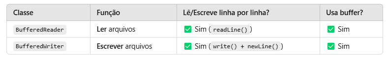

## BufferedReader e BufferedWriter

📌 BufferedReader - Para leitura de arquivos
O BufferedReader é uma classe que lê arquivos de texto de forma eficiente,
armazenando os dados em um buffer para evitar acessos diretos ao disco toda vez que um caractere é lido.

📌 BufferedWriter - Para escrita em arquivos
O BufferedWriter é usado para escrever em arquivos de forma eficiente,
armazenando os dados em um buffer antes de escrevê-los fisicamente no arquivo.

📌 Diferença entre BufferedReader e BufferedWriter

📌 Conclusão
BufferedReader → Para ler arquivos linha por linha.
BufferedWriter → Para escrever em arquivos de forma otimizada.
Ambos são mais rápidos do que FileReader e FileWriter porque usam buffer interno.